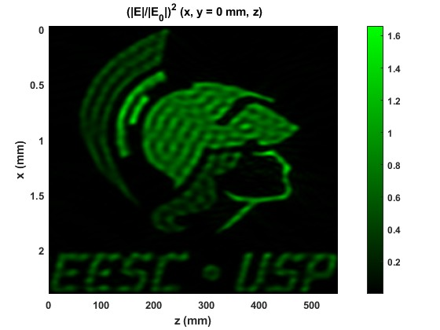

# Holographic light sheets

A <a href="https://www.mathworks.com/products/matlab.html">MATLAB</a> code to simulate holographic light sheets [[1](#references)] based on discrete superpositions of scalar ideal frozen waves [[2,3](#references)].

  

## How to use
All files you need are available at *holographic-light-sheets_code* folder.

To run this code in the MATLAB environment:
- Select `Browser for folder` in the upper left corner;
- Search for the folder *holographic-light-sheets_code*;
- Open and run the file *main_grayscale.m*.

You may change the input image and the other parameters as desired.

## Authorship
This code was main developed by <a href="https://www.researchgate.net/profile/Vinicius-De-Angelis">Vinicius S. de Angelis</a>, with contributions of <a href="https://www.researchgate.net/profile/Jhonas-de-Sarro">Jhonas O. de Sarro</a> ([@jodesarro]( https://github.com/jodesarro )), in colaboration with Professor <a href="https://www.researchgate.net/profile/Leonardo-Ambrosio">Leonardo A. Ambrosio</a>, of <a href="http://www.sel.eesc.usp.br/leonardo">Applied Electromagnetics Group (AEG)</a> from University of São Paulo (USP), and the authors of Ref. [[1](#references)].

## Corresponding author
Correspondence to the main author of this code <a href="https://www.researchgate.net/profile/Vinicius-De-Angelis">Vinicius S. de Angelis</a> preferably by <a href=mailto:vinicius.angelis@usp.br>email</a>.

## Competing interests
The authors of Ref. [[1](#references)] have filed a provisional patent application based on their work.

## References
[1] <a href="https://doi.org/10.1038/s41566-023-01188-y">A. H. Dorrah, P. Bordoloi, V. S. de Angelis, J. O. de Sarro, L. A. Ambrosio, M. Zamboni-Rached, F. Capasso, "Light sheets for continuous-depth holography and three-dimensional volumetric displays," Nat. Photon. (2023).</a>

[2] <a href="https://doi.org/10.1364/OPEX.12.004001">M. Zamboni-Rached, "Stationary optical wave fields with arbitrary longitudinal shape by superposing equal frequency Bessel beams: Frozen Waves," Opt. Express 12, 4001-4006 (2004).</a>

[3] <a href="https://doi.org/10.1364/JOSAB.36.000638">L. A. Ambrosio, "Millimeter-structured nondiffracting surface beams," J. Opt. Soc. Am. B 36, 638-645 (2019).</a>
